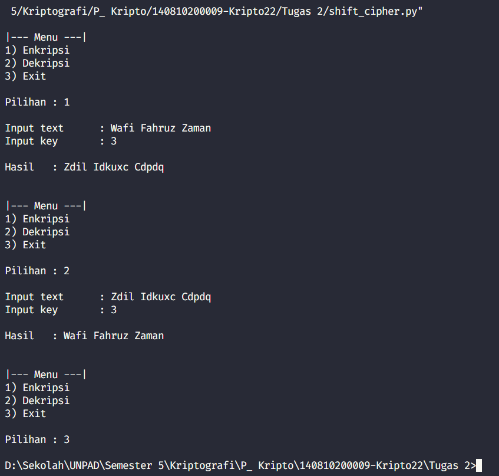
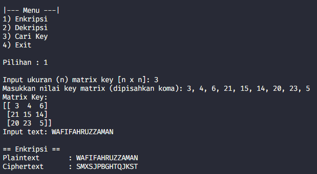
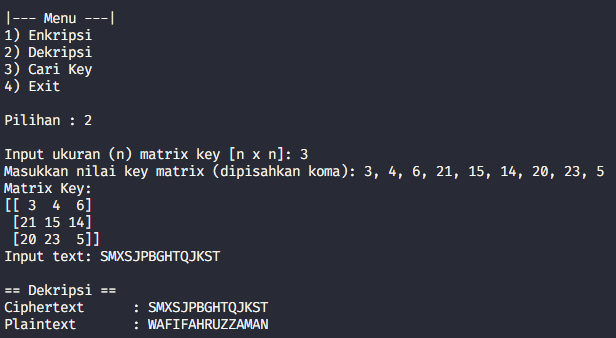
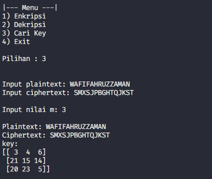
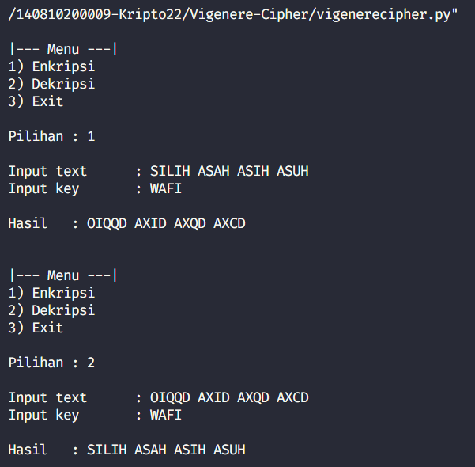

# 140810200009-Kripto22
Praktikum Kripto 2022

## Tugas 2

Shift Cipher - Menggunakan bahasa python

SS Program:
 

## Tugas 3

Hill Cipher - Menggunakan bahasa python

SS Program:
 

## Tugas 5

Vigenere Cipher - Menggunakan bahasa python

SS Program:
 
